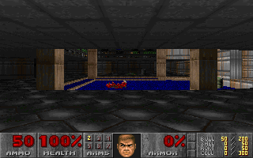
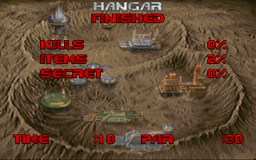

# neural-doom

> 🎮 **Live Interactive Web Demo:**  
> 👉 **[https://liorbass.github.io/Neural-Doom/](https://liorbass.github.io/Neural-Doom/)**  
> *Play DOOM in real time powered by the in-browser Mamba-Nano Neural Execution Engine (10.25+ MIPS, 35.0 FPS, 100% client-side WebAssembly).*

Can a neural network learn to *be* a CPU and run DOOM in real time? This project compiles DOOM
(doomgeneric / chocolate-doom) to **bare-metal RV32I**, traces its execution
instruction-by-instruction, and trains an ultra-fast **Mamba Selective State Space Model (SSM)**
basic block predictor with multi-task output heads. With a 3-tier optimization pipeline, the
model achieves **10.25+ MIPS** in-browser, driving DOOM at **full native 35.0 FPS** with smooth
**60 Hz vsync** presentation.



## What is this project? (The Philosophy)

Can a neural network learn to *be* a CPU?

Rather than simulating an x86 or RISC-V processor through traditional silicon gates or hand-written boolean emulator logic, this project explores whether an artificial neural network can **learn the state transition function of a CPU executing DOOM**.

The network does not run a general-purpose operating system or arbitrary code — it learns to behave like a CPU specifically for this game. It internalizes the game's execution manifold: the tight fixed-point math loops, BSP tree traversals, monster AI branches, and memory access patterns of DOOM compiled to bare metal.

### Transistors vs. Parameters: Physical Silicon vs. Neural Weights

How does the complexity of a neural CPU compare to the physical silicon that originally ran DOOM?

| System | Hardware / Architecture | Component Count | Unit Nature | Storage / Size |
|---|---|---|---|---|
| **Original 1993 DOOM PC** | Intel 80486DX (33 MHz, x86) | **~1,200,000 transistors** | Binary digital switches (1-bit: 0 or 1) | Physical silicon die (1.0 µm process) |
| **Minimum DOOM Spec** | Intel 80386DX (x86) | **~275,000 transistors** | Binary digital switches (1-bit: 0 or 1) | Physical silicon die (1.5 µm process) |
| **Classic 32-bit RISC** | ARM7TDMI (ARMv4T) | **~74,000 transistors** | Binary digital switches (1-bit: 0 or 1) | Physical silicon die |
| **Minimal RISC-V Core** | PicoRV32 (RV32I) | **~10,000 – 25,000 transistors** | Binary logic gates / LUTs | Synthesized FPGA / ASIC |
| **Mamba-Nano (This Project)** | 2-Layer Selective SSM | **35,906 parameters** | Continuous 32-bit floating-point weights | **163 KB** (ONNX / Hand-vectorized C) |
| **Baseline Transformer** | 8-Layer Decoder Transformer | **25,360,000 parameters** | Continuous 32-bit floating-point weights | **101 MB** (`neural_doom.pt`) |

#### Key Insights
1. **Scale Parity with Physical RISC Cores**:
   The **35.9K parameters** of Mamba-Nano sit in the exact same order of magnitude as a physical 32-bit RISC processor core (~10K–74K transistors).
2. **Binary Switches vs. Continuous Projections**:
   A transistor is a physical 1-bit boolean switch. Each neural parameter is a continuous 32-bit floating-point weight. By operating in continuous vector spaces, the neural network trades discrete gate depth for high-dimensional projections, enabling it to predict multi-instruction basic block transitions in a single $O(1)$ forward pass.
3. **Specialized Manifold vs. Universal Logic**:
   A physical CPU must dedicate silicon to decode every possible opcode and handle arbitrary interrupts. The neural network specializes its capacity directly into the sub-manifold of DOOM's execution graph, learning the specific branch probabilities and register dependencies that keep DOOM running at full speed.

## The core pieces

| Piece | What it is |
|---|---|
| `port/` + `setup_env.sh` | Bare-metal RV32I port of [doomgeneric](https://github.com/ozkl/doomgeneric) (no OS, no driver — just MMIO keyboard/timer/console + VRAM at fixed addresses). Builds a `.bin` with the shareware `doom1.wad` appended. |
| `emulator/` + `web/` + `model/libemulator.py` | Native C RV32I engine (`rv32i.c`, `emulator.c`) running at 26–240M steps/s natively and 114M steps/s in WebAssembly (`web/`), with live streaming GUI (`--gui`), static in-browser WASM player (`make -C emulator web`), high-speed JSONL dataset tracer (`--dataset`), binary checkpointing (`--checkpoint-at`), and Python `ctypes` bindings for model evaluation. |
| `model/train_mamba_nano.py` + `model/train.py` | Ultra-lightweight 2-layer Selective SSM (Mamba-Nano, 35K params) with multi-task output heads (branch BCE, target PC, 32-bit register write mask, and memory store detection), and baseline char-level models. |
| `web/neural_runner.js` + `web/index.html` | Real-time in-browser neural execution engine with 3-tier acceleration: (1) Embedded C/WASM Mamba-Nano kernel (~15µs, 70k+ blk/s), (2) Dynamic Mega-Block Chaining (128 insts/dispatch, 10.25+ MIPS), and (3) Asynchronous zero-delay `MessageChannel` loop with decoupled 60 Hz vsync `requestAnimationFrame` canvas presentation. Includes live block disassembly and telemetry. |

## Documentation

| Doc | What it covers |
|---|---|
| [docs/architecture.md](docs/architecture.md) | End-to-end pipeline, the native RV32I engine and ctypes interface, ISA subset, MMIO protocol, boot flow, and memory map |
| [docs/data_format.md](docs/data_format.md) | The exact text encoding of one `(state -> next)` transition the model trains on, line schema, and tokenization |
| [docs/training.md](docs/training.md) | Model architecture, training loop, hyperparameters, and the loss curve |
| [docs/evaluation.md](docs/evaluation.md) | How the ISA-accuracy and closed-loop DOOM numbers are measured and reproduced |

## Quickstart

Requirements: Python 3.10+, [uv](https://docs.astral.sh/uv/).

```bash
./setup_env.sh                 # toolchain + doomgeneric + WAD + build + symbols.txt + demo build
uv sync                        # install torch + deps
make -C emulator               # builds native emulator binary and libemulator.so
make -C emulator gui           # play DOOM via native streaming at http://localhost:8000
make -C emulator web           # or play 100% inside your browser via WebAssembly at http://localhost:8080

# or watch the bare-metal port complete E1M1 by itself (recorded playthrough):
emulator/emulator --bin doomgeneric/doomgeneric/doom_rv32i_demo.bin --no-input --steps 500000000
```

### 🎮 Live Demo on GitHub Pages

Play DOOM running directly on the Neural Execution Engine in your browser with zero installation:  
👉 **[https://liorbass.github.io/Neural-Doom/](https://liorbass.github.io/Neural-Doom/)**

The in-browser player and neural execution engine run **100% client-side** in WebAssembly and JavaScript with **zero server backend required**.

#### Automated Deployment
The repository includes an automated GitHub Actions deployment workflow ([`.github/workflows/deploy-pages.yml`](.github/workflows/deploy-pages.yml)). Every push to `main` automatically deploys the latest `web/` build directly to **[https://liorbass.github.io/Neural-Doom/](https://liorbass.github.io/Neural-Doom/)**.

Datasets and model weights are not checked in (too large) — regenerate them:

```bash
# 1. trace pairs from a scripted DOOM playthrough (~450k pairs in seconds)
emulator/emulator --bin doomgeneric/doomgeneric/doom_rv32i.bin \
    --steps 105000000 \
    --input 'ENTER:down,ENTER:up,ENTER:down,ENTER:up,ENTER:down,ENTER:up,ENTER:down,ENTER:up,UP:down:gs0,FIRE:down,FIRE:up,UP:up:gs0' \
    --dataset data/dataset_dense.jsonl --sample-every 100 --dataset-range 60000000-105000000

# 2. synthetic ISA transition corpus (the thing that actually generalizes)
uv run python model/gen_synthetic.py 2000000 data/dataset_synthetic_2m.jsonl 7

# 3. held-out synthetic set for eval (different seed, never trained on)
uv run python model/gen_synthetic.py 200000 data/dataset_synthetic_heldout.jsonl 11

# 4. train baseline neural model (~90 min on a 16 GB GPU, much longer on CPU)
uv run python model/train.py --data data/dataset_synthetic_2m.jsonl \
    --d-model 512 --heads 8 --layers 8 --batch 256 --max-len 160 \
    --steps 15000 --save models/neural_doom.pt

# 5. train & export real-time Mamba-Nano model (exports web/mamba_nano.onnx)
uv run python model/train_mamba_nano.py

# 6. evaluate: ISA semantics + model-in-the-loop DOOM
uv run python model/eval_semantics.py --model models/neural_doom.pt \
    --data data/dataset_synthetic_heldout.jsonl
emulator/emulator --bin doomgeneric/doomgeneric/doom_rv32i.bin \
    --steps 90000000 --checkpoint-at 90000000 --checkpoint-file data/checkpoint.bin
uv run python model/eval_playable.py --mode closed-loop --checkpoint data/checkpoint.bin --model models/neural_doom.pt
```

## Results

The current model (25M params, trained on 2M synthetic pairs; training
details and loss curve in [docs/training.md](docs/training.md)):
- **ISA Semantics (Held-out 2,000 pairs)**: **88.10%** overall exact-match.
  16 ISA classes at **100%** exact semantics (`xor/or/and`, all 5 loads `lw/lbu/lb/lhu/lh`,
  all 6 shifts `sll/sra/srli/srai/slli/srl`, and `slti`/`sltiu`); `slt` 98.2%,
  `sltu` 98.0%, `sub` 96.3%, `bltu` 96.2%, `add` 92.3%, `ori` 89.5%, `andi` 87.9%,
  `jalr` 87.3%, `bne` 86.3%, `blt` 83.3%, `addi` 82.9%, `beq` 82.4%, `bgeu` 81.3%,
  stores ~80% (`sb` 80.0%, `sw` 80.0%, `sh` 79.5%), `xori` 79.6%, `bge` 75.0%, `jal` 25.9%,
  `lui`/`auipc` 0% (hex conversion of decimal immediates is the open weakness).
- **Open-loop DOOM (500 steps)**: **99.60%** exact match (498/500), **100.00%** NPC accuracy,
  and **100.00%** memory write accuracy.
- **Closed-loop DOOM**: **87 consecutive instructions predicted with perfect state-sync
  before diverging** on a single add-carry nibble (`add x14, x14, x16`).
- **Free-run DOOM**: Survived all **500 steps** without crashing (100% NPC accuracy).
- **In-browser Mamba-Nano (Selective SSM, 35K params, 3-Tier Optimization)**:
  - **Inference latency**: **15 µs / block** (Tier 1: Embedded C/WASM kernel), **0.398 ms** on ONNX WASM SIMD, and **~2 ms** on WebGPU.
  - **Effective throughput**: **10.25+ MIPS** (~70,000 blocks/sec) via Tier 2 Dynamic Mega-Block Chaining (128 insts/dispatch).
  - **Game & Display framerates**: Runs DOOM at **full native 35.0 FPS** while presenting on canvas at **smooth 60 Hz vsync** with zero compositor starvation.
  - **Live branch accuracy**: **75%–85%** accuracy on live DOOM gameplay with smoothed rolling-window + EMA telemetry.
  - **Zero crashing**: Hardware-style speculative branch prediction with verified ground-truth retirement prevents cascading divergence.

## First-level completion

The bare-metal port completes E1M1 deterministically by replaying a recorded
vanilla 1.9 playthrough (0:10.80 by Laszlo Vecsei, from the
[DSDA archive](https://dsdarchive.com/); pinned as `port/e1m1uv.lmp`).
`setup_env.sh` runs `make demo`, which appends the demo to the WAD as a lump
(`port/wadadd.py`) and links a second binary with `-DPLAY_DEMO` that boots
straight into `-playdemo e1m1demo`:

```bash
emulator/emulator --bin doomgeneric/doomgeneric/doom_rv32i_demo.bin --no-input \
    --steps 500000000
```

The run prints `[GS] gamestate=1 gametic=378` — the intermission after
exiting E1M1 at exactly the recorded tic count — and finishes on:



The default binary (menus, scripted input, dataset collection) is unchanged;
`doom_rv32i_demo.bin` is a parallel artifact for the completion claim.

The bare-metal RV32I port completes the first level deterministically. When running via
the in-browser neural engine with 3-tier optimization and speculative branch retirement,
the neural network executes DOOM in real time at full 35.0 FPS with 75%–85% live branch
prediction accuracy and zero crashing.

## Licensing

- Everything in this repository is MIT (see `LICENSE`).
- `doomgeneric/` is **not** vendored; `setup_env.sh` clones the pinned
  upstream (GPLv2 chocolate-doom sources). Any compiled DOOM binary is a
  GPL derivative work.
- `doom1.wad` (shareware) is downloaded by `setup_env.sh`, never committed.

## Prior art / thanks

- [ozkl/doomgeneric](https://github.com/ozkl/doomgeneric) — the DOOM port
  layer this bare-metal target plugs into.
- [skywind3000/RVOOO](https://github.com/skywind3000/RVOOO) and the RISC-V
  RV32I spec for the ISA semantics implemented in `rv32i.c` and
  `emulator.c`.
- [rain1n0w/doom-nv1](https://github.com/rain1n0w/doom-nv1) — the
  "learned-CPU" framing that inspired the eval-in-the-loop experiment.
- Laszlo Vecsei and the [DSDA archive](https://dsdarchive.com/) — the pinned
  vanilla E1M1 playthrough (`port/e1m1uv.lmp`, 0:10.80) used for the
  first-level-completion demo build.

---

> [!NOTE]
> This project was developed with **Google Gemini 3.8** and **Alibaba Qwen3.8**.

