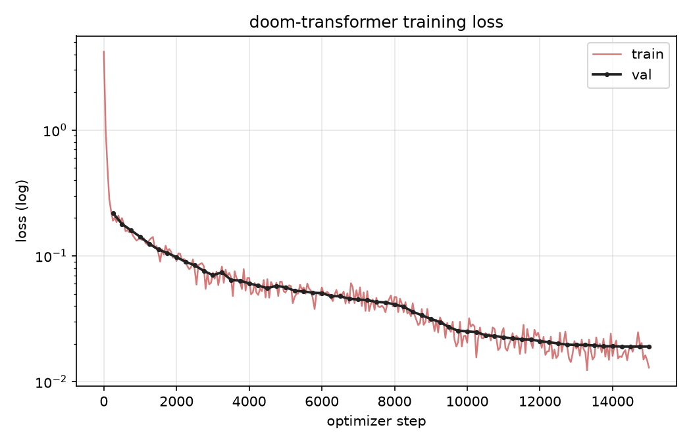

# Training

How the models in neural-doom are trained, and how to reproduce a run.

## Task formulation

The baseline model is a char-level, decoder-only network that learns the CPU
next-state function. Each training example is a JSONL pair produced by
`emulator/emulator` or `model/gen_synthetic.py`:

```json
{"state": "[CMD] STEP\n[PC] ...\n[INST] ...\n[REG ...] ...",
 "next":  "[NPC] ...\n[W_REG ...] ...\n[W_MEM ...] ..."}
```

The trainer concatenates `state + "\n=>\n" + next` and trains with
cross-entropy **masked to the `next` portion only** (plus EOS), so the model
spends no capacity on copying the prompt. At inference time the prompt is
prefixed and the model greedy-decodes the predicted next state.

## Data

Two corpora, both regenerable:

| Corpus | Source | Purpose |
|---|---|---|
| DOOM traces | `emulator/emulator` boots the bare-metal RV32I binary and samples real `(state -> next)` pairs during a scripted E1M1 playthrough | distribution the model is evaluated in |
| Synthetic ISA transitions | `model/gen_synthetic.py` emits randomized legal RV32I steps | the corpus that actually generalizes |

Traces alone lead to memorization; the synthetic corpus is what teaches ISA
semantics.

## Baseline Model

`model/train.py` implements the baseline architecture (see `DoomTransformer`):

- char tokenizer over the trace alphabet (vocab 57)
- learned token + positional embeddings
- pre-norm transformer blocks: causal multi-head attention + GELU FFN
- linear head over the vocab

The current configuration is 25.36M params: `d_model=512`, 8 heads, 8
layers, FFN mult 4, `max_len=160`.

## Training loop

- AdamW (lr 3e-4), cosine LR schedule over the full step budget, grad-norm
  clip 1.0
- batches sampled **with replacement**, so runs are measured in optimizer
  steps rather than epochs; loss is logged every 50 steps
- validation every 250 steps on a held-out 5% split; the best-val checkpoint
  is saved to `models/neural_doom.pt`
- ends with a few greedy-decode sanity samples (`[DECODE]` in the log)

## How to run

```bash
uv sync

# 1. synthetic corpus (2M pairs; the generalization driver)
uv run python model/gen_synthetic.py 2000000 data/dataset_synthetic_2m.jsonl 7

# 2. train (~90 min on a 16 GB GPU, much longer on CPU)
uv run python model/train.py --data data/dataset_synthetic_2m.jsonl \
    --d-model 512 --heads 8 --layers 8 --batch 256 --max-len 160 \
    --steps 15000 --save models/neural_doom.pt

# 3. held-out synthetic set (different seed, never trained on) + evaluate
uv run python model/gen_synthetic.py 200000 data/dataset_synthetic_heldout.jsonl 11
uv run python model/eval_semantics.py \
    --data data/dataset_synthetic_heldout.jsonl
uv run python model/eval_playable.py --mode closed-loop
```

DOOM-trace data (for evaluation in-distribution) is collected with
`emulator/emulator --bin doomgeneric/doomgeneric/doom_rv32i.bin ...` — see the
README quickstart for the full scripted-input schedule.

## Loss curve



Train loss is logged every 50 steps, val every 250. Regenerate the chart
from `logs/train.log` with:

```bash
uv run python model/plot_loss.py
```

Current run: 15000 steps over 2M synthetic pairs, best val loss **0.0190**.

---

## Mamba-Nano: Ultra-Lightweight 2-Layer Selective SSM & Multi-Task Predictor

To enable real-time in-browser neural execution (up to 70,000 blocks/sec and 10.25+ MIPS), a compact Selective State Space Model (SSM) was introduced.

### Architecture & Feature Encoding (`model/train_mamba_nano.py`)
- **Layers**: 2 pure Selective SSM layers with $O(1)$ constant compute and memory per step.
- **Dimensions**: `d_model = 64`, `d_state = 16`, `dt_rank = 8`.
- **Parameter Count**: **35,906 parameters** (~163 KB ONNX, hand-vectorized in C for `rv32i.wasm`).
- **Inputs**:
  - `pc_bits`: 32-bit unpacked binary bit vector of guest program counter `(1, 1, 32)` to eliminate address hallucination.
  - `regs_norm`: 32 non-linearly normalized guest register values `(1, 1, 32)` via $\ln(1 + R)/22.2$, preserving small integer values and pointer offsets.
  - `s0`, `s1`: Recurrent SSM states `(1, 64, 16)`.
- **Outputs (Multi-Task Heads)**:
  - `branch_taken_logits`: Branch prediction logit (BCE loss for TAKEN vs. FALLTHROUGH).
  - `next_pc_offset`: Linear next-PC offset head for branch targets.
  - `reg_write_mask`: 32-bit sigmoid output identifying general-purpose registers modified in the block.
  - `mem_write_active`: Detection of memory store instructions consuming bus slots.
  - `s0_out`, `s1_out`: Updated recurrent SSM hidden states ($h_t \in \mathbb{R}^{64 \times 16}$).

### Training & Export
```bash
# Train on 10,000 real DOOM block transitions and export to web/mamba_nano.onnx
uv run python model/train_mamba_nano.py
```
Export uses the PyTorch legacy TorchScript exporter (`dynamo=False, opset_version=18`) for seamless compatibility with ONNX Runtime Web, as well as being compiled into the hand-vectorized C kernel inside `emulator/rv32i.c`.
